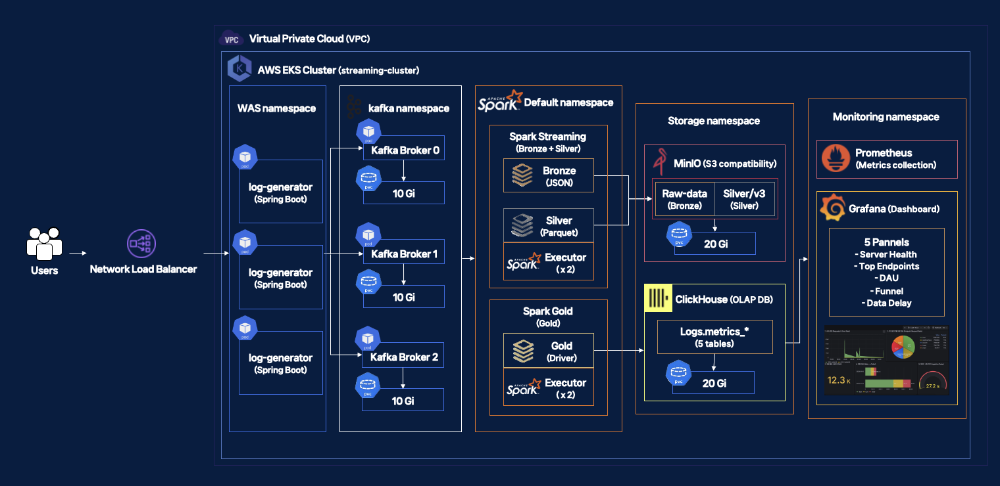

# Kubernetes Deployment for Streaming Data Pipeline

이 프로젝트는 Amazon EKS(Elastic Kubernetes Service) 클러스터에 실시간 데이터 스트리밍 pipeline을 배포하기 위한 Kubernetes manifest 파일들을 포함합니다.

## Architecture Overview


시스템은 다음과 같은 컴포넌트로 구성됩니다:

```
Web Application Server (WAS)
    |
    v
Kafka Cluster (Strimzi) ──> Kafka Connect
    |                          |
    v                          v
Spark Streaming Application  Monitoring Stack
                              (Prometheus, Grafana, Kafka Exporter)
```

### Component Flow

1. **Web Application Server**: 사용자 활동 로그를 생성하고 Kafka로 전송
2. **Kafka Cluster**: 메시지 브로커로 실시간 데이터 스트리밍 허브 역할
3. **Spark Application**: Kafka에서 데이터를 소비하여 실시간 처리

## CI/CD (Added in this fork)

이 포크는 Spark Streaming 애플리케이션의 검증과 배포를 자동화하는 **GitHub Actions 기반의 CI / CT / CD pipeline**을 도입합니다.

```
Developer push (main)
  ↓
GitHub Actions
  ↓
CI: ruff lint
  ↓
CI: pytest unit tests + coverage gate (pytest-cov)
  ↓
CI: docker build (no push)
  ↓
CT: container smoke test (spark-submit --version)
  ↓
CD: push image (GHCR)
  ↓
CD: Kubernetes rolling deployment + rollout wait
```

- **Trigger**: `main` branch push 시 자동 실행
- **Workflow file**: `.github/workflows/ci-cd.yml`

이 pipeline은 코드 품질, 컨테이너 유효성, Kubernetes 배포를 새 버전 릴리즈 전에 자동으로 검증합니다.

---

## CI / CT / CD Stages

### CI (Continuous Integration)

검증된 코드만 main 브랜치에 반영되도록 보장합니다.

실행 작업:

- `ruff check spark_app tests`
- `pytest` unit tests
- `pytest-cov` coverage measurement

coverage 결과는 CI artifact로 업로드되며, 설정된 임계값 미만일 경우 pipeline이 실패합니다.

---

### CT (Continuous Testing)

배포 전, 빌드된 컨테이너 이미지가 실제로 실행 가능한지 검증합니다.

Container smoke test:

```bash
docker run <image> spark-submit --version
```

빌드는 성공했지만 실행에 실패하는 이미지가 배포되는 것을 방지합니다.

---

### CD (Continuous Deployment)
 
모든 검증 단계를 통과하면 자동 배포를 수행합니다.
 
Steps:

1. **GitHub Container Registry (GHCR)** 에 Docker 이미지 push
2. Kubernetes deployment manifest에 새 이미지 태그 반영
3. Kubernetes cluster에 manifest 적용
4. 아래 명령으로 rollout 완료 여부 확인:
 
```bash
kubectl rollout status
```
 
Deployment 전략:
 
```yaml
RollingUpdate
maxUnavailable: 0
maxSurge: 1
```
 
이를 통해 무중단에 가까운 배포(near zero-downtime)를 보장합니다.
 
---

## Manual → Automated Deployment

**Before CI/CD:**
 
1. 로컬에서 테스트 실행
2. Docker 이미지 빌드
3. Docker 이미지 태깅
4. 레지스트리에 이미지 push
5. Kubernetes manifest 적용
6. rollout 상태 대기
 
**After CI/CD:**
 
1. 개발자가 코드 push
2. GitHub Actions가 테스트, 린트, coverage 검사 자동 실행
3. Docker 이미지 자동 빌드
4. GHCR에 이미지 자동 push
5. Kubernetes rolling deployment 자동 트리거
6. pipeline이 rollout 완료를 대기 및 확인
 
개발자의 수동 작업은 아래 한 단계로 줄었습니다.
 
```bash
git push
```
 
---
 
## Docker Image Build and Push

Docker 이미지는 repository root의 `Dockerfile`을 기반으로 빌드됩니다.
 
Tagging 전략:
 
```
ghcr.io/<owner>/<repo>/spark-streaming:<git-sha>
ghcr.io/<owner>/<repo>/spark-streaming:latest
```

Git 커밋과 배포된 컨테이너 간의 추적성을 보장합니다.
 
---
 
## Kubernetes Rolling Updates
 
Manifest 위치:
 
```
K8s/K8s/spark-streaming-deployment.yaml
```
 
Deployment 전략:
 
```yaml
RollingUpdate
maxUnavailable: 0
maxSurge: 1
```
 
pipeline이 새 이미지 태그를 주입하고 rollout 완료를 대기하여 배포 안정성을 보장합니다.
 
---
 
## Deployment Verification

Deployment manifest는 local Kubernetes cluster(`docker-desktop`)에서도 추가 검증되었습니다.
 
사용 명령어:
 
```bash
kubectl apply -f K8s/K8s/spark-streaming-deployment.yaml
kubectl rollout status deployment/spark-streaming --timeout=300s
kubectl get pods -l app=spark-streaming
```
 
이를 통해 배포 manifest가 올바르게 동작하고 Kubernetes 환경에서 애플리케이션이 정상 기동됨을 확인했습니다.

---
 
## Required GitHub Secrets
 
| Secret | Description |
|--------|-------------|
| `KUBE_CONFIG_DATA` | Base64 encoded kubeconfig used by GitHub Actions to authenticate with the Kubernetes cluster |
 
---
 
## Automation Impact
 
최근 검증된 pipeline 실행 결과:
 
| Metric | Value |
|--------|-------|
| Total pipeline runtime | 2m 43s |
| Successful jobs | 6 (CI 3 / CT 1 / CD 2) |
| Line coverage | 95.24% (20 / 21 lines covered) | 
| Manual deployment steps | 6 |
| Developer interaction | `git push` |
 
**Operational improvements:**
 
- 테스트 실패 또는 coverage 미달 시 deployment 자동 차단
- Container smoke 테스트로 실행 불가 이미지 배포 방지
- Kubernetes rollout 완료 검증 후 pipeline 성공 처리
 
---
 
## Prerequisites
 
- Amazon EKS cluster (created using `eksctl`)
- `kubectl` installed with cluster access
- Strimzi Kafka Operator
- Spark Operator
 
---
 
## Namespace Structure
 
| Namespace | Description |
|-----------|-------------|
| `kafka` | Kafka cluster and related components |
| `was` | Web Application Server |
| `logging-system` | Log generator |
| `default` | Spark application resources |
| `spark-operator` | Spark operator |
| `monitoring` | Prometheus, Grafana, Kafka exporter |


## Deployment Components

### 1. Kafka Infrastructure

#### Kafka Cluster (Strimzi)
- **File**: `kafka-strimzi.yaml`, `kafka-nodepool.yaml`
- **Namespace**: `kafka`
- **Cluster Name**: `streaming-cluster`
- **Brokers**: 3개
- **Version**: Kafka 3.7.0
- **Storage**: Persistent Volume (10Gi per broker)

#### Kafka Topics
- **Files**: `topic.yaml`, `topic-user-activity-logs.yaml`
- **Topics**: 
  - `streaming-topic` (3 파티션, 3 리플리케이션)
  - `user-activity-logs` (WAS와 Spark가 사용, 3 파티션, 3 리플리케이션)
- **Retention**: 600000ms (10 minutes)

#### Kafka Service
- **Bootstrap Service**: `streaming-cluster-kafka-bootstrap.kafka.svc.cluster.local:9092`
- **Type**: ClusterIP
- **Port**: 9092

### 2. Web Application Server (WAS)

#### Deployment
- **File**: `was-deployment.yaml`
- **Namespace**: `was`
- **Replicas**: 2
- **Image**: `ji0513ji/log-generator:1.1.2`
- **Port**: 8080

#### Health Checks
- **Liveness Probe**: `/main` endpoint, 60초 초기 지연
- **Readiness Probe**: `/main` endpoint, 30초 초기 지연

#### Services
- **Internal Service**: `was-service` (ClusterIP, port 80)
- **External Service**: `was-service-external` (NodePort, port 30080)

#### Environment Variables
- `KAFKA_BOOTSTRAP_SERVERS`: `streaming-cluster-kafka-bootstrap.kafka.svc.cluster.local:9092`
- `SPRING_KAFKA_BOOTSTRAP_SERVERS`: `streaming-cluster-kafka-bootstrap.kafka.svc.cluster.local:9092`
- **사용 토픽**: `user-activity-logs`

### 3. Spark Application

#### Spark Pod (Direct Deployment)
- **File**: `spark-direct.yaml`
- **Namespace**: `default`
- **Pod Name**: `spark-streaming`
- **Image**: `doyoomii/spark-k8s:latest`
- **Main Application**: `user_activity_streaming.py` (ConfigMap에서 마운트)
- **Kafka 토픽**: `user-activity-logs`
- **MinIO 연결**: `http://minio.storage.svc.cluster.local:9000`
- **S3A 라이브러리**: `org.apache.hadoop:hadoop-aws:3.3.4`, `org.apache.hadoop:hadoop-common:3.3.4`

#### SparkApplication Resource (대안)
- **File**: `spark-app.yaml`
- **Namespace**: `default`
- **Type**: Python
- **Mode**: cluster
- **Spark Version**: 3.3.1
- **Image**: `doyoomii/spark-k8s:latest`
- **Main Application**: `user_activity_streaming.py`

#### Driver Configuration
- **Cores**: 1
- **Memory**: 1g
- **Service Account**: `spark`

#### Executor Configuration
- **Cores**: 1
- **Memory**: 2g
- **Instances**: 2

#### Environment Variables
- `KAFKA_BOOTSTRAP_SERVERS`: `streaming-cluster-kafka-bootstrap.kafka.svc.cluster.local:9092`

#### Supporting Resources
- **ServiceAccount**: `spark-serviceaccount.yaml`
- **ConfigMap**: `spark-code-configmap.yaml` (Spark 스트리밍 코드 포함)

### 4. Log Generator

#### Deployment
- **File**: `log-generator.yaml`
- **Namespace**: `logging-system`
- **Replicas**: 1
- **Image**: `ji0513ji/log-generator:1.1.1`

#### Environment Variables
- `KAFKA_BOOTSTRAP_SERVERS`: `streaming-cluster-kafka-bootstrap.kafka.svc.cluster.local:9092`

### 4. Monitoring Stack

#### Prometheus
- **File**: `prometheus-deployment.yaml`, `prometheus-configmap.yaml`
- **Namespace**: `monitoring`
- **Port**: 9090
- **Storage**: EmptyDir (프로덕션에서는 PersistentVolume 사용 권장)
- **Scrape Targets**: Kafka Exporter, Prometheus itself

#### Grafana
- **File**: `grafana-deployment.yaml`
- **Namespace**: `monitoring`
- **Port**: 3000 (Internal), 30300 (NodePort)
- **Default Credentials**: admin/admin
- **Data Source**: Prometheus (자동 설정 필요)

#### Kafka Exporter
- **File**: `kafka-exporter-deployment.yaml`
- **Namespace**: `monitoring`
- **Port**: 9308
- **Purpose**: Kafka 메트릭을 Prometheus 형식으로 노출

### 5. Kafka Connect

#### KafkaConnect Resource (Strimzi)
- **File**: `kafka-connect.yaml`
- **Namespace**: `kafka`
- **Replicas**: 2
- **Version**: 4.0.0
- **Purpose**: Kafka와 외부 시스템 간 데이터 연결 (예: HDFS Sink Connector)

### 6. Storage (MinIO)

#### MinIO Deployment
- **File**: `minio-deployment.yaml`
- **Namespace**: `storage`
- **Replicas**: 1
- **Image**: `minio/minio:latest`
- **Ports**: 9000 (API), 9001 (Console)
- **Services**:
  - `minio` (ClusterIP)
  - `minio-external` (NodePort 30900, 30901)
- **Credentials**: admin/password1234
- **Bucket**: mybucket (생성 필요)

## Deployment Instructions

### 1. EKS Cluster Setup

```bash
# eksctl을 사용한 클러스터 생성 (cluster.yaml 참조)
eksctl create cluster -f cluster.yaml
```

### 2. Strimzi Kafka Operator 설치

```bash
kubectl create namespace kafka
kubectl apply -f 'https://strimzi.io/install/latest?namespace=kafka' -n kafka
```

### 3. Kafka Cluster 배포

```bash
kubectl apply -f kafka-strimzi.yaml
kubectl apply -f kafka-nodepool.yaml
kubectl apply -f topic.yaml
kubectl apply -f topic-user-activity-logs.yaml
```

### 4. Spark Operator 설치

```bash
helm repo add spark-operator https://googlecloudplatform.github.io/spark-on-k8s-operator
helm install spark-operator spark-operator/spark-operator --namespace spark-operator --create-namespace
```

### 5. Spark Resources 배포

```bash
kubectl apply -f spark-serviceaccount.yaml
kubectl apply -f spark-code-configmap.yaml
```

### 6. WAS 배포

```bash
kubectl create namespace was
kubectl apply -f was-deployment.yaml
kubectl apply -f was-service-external.yaml
```

### 7. Log Generator 배포

```bash
kubectl create namespace logging-system
kubectl apply -f log-generator.yaml
```

### 8. Spark Application 배포

**방법 1: Pod 방식 (권장)**
```bash
kubectl apply -f spark-direct.yaml
```

**방법 2: SparkApplication 방식**
```bash
kubectl apply -f spark-app.yaml
```

### 9. MinIO 배포

```bash
kubectl create namespace storage
kubectl apply -f minio-deployment.yaml

# MinIO 버킷 생성 (Pod 내부에서 실행)
kubectl exec -it $(kubectl get pods -n storage -l app=minio -o jsonpath='{.items[0].metadata.name}') -n storage -- \
  sh -c "mc alias set myminio http://localhost:9000 admin password1234 && mc mb myminio/mybucket --ignore-existing"
```

### 10. 모니터링 스택 배포 (Prometheus, Grafana, Kafka Exporter)

```bash
# monitoring 네임스페이스 생성
kubectl create namespace monitoring

# Prometheus ConfigMap 배포
kubectl apply -f prometheus-configmap.yaml

# Prometheus 배포
kubectl apply -f prometheus-deployment.yaml

# Kafka Exporter 배포
kubectl apply -f kafka-exporter-deployment.yaml

# Grafana 배포
kubectl apply -f grafana-deployment.yaml
```

### 11. Kafka Connect 배포

```bash
kubectl apply -f kafka-connect.yaml
```

## Verification

### 전체 리소스 상태 확인

```bash
kubectl get pods --all-namespaces
```

### Kafka 클러스터 확인

```bash
kubectl get kafka -n kafka
kubectl get kafkatopic -n kafka
kubectl get pods -n kafka
```

### WAS 상태 확인

```bash
kubectl get pods -n was
kubectl get svc -n was
```

### Spark Application 상태 확인

```bash
kubectl get sparkapplication -n default
kubectl get pods -n default | grep spark
```

## Service Endpoints

### Kafka Bootstrap Server
- **Internal**: `streaming-cluster-kafka-bootstrap.kafka.svc.cluster.local:9092`
- **Topics**: 
  - `streaming-topic`
  - `user-activity-logs` (WAS와 Spark가 사용)

### WAS Services
- **Internal**: `was-service.was.svc.cluster.local:80`
- **External**: `<NodeIP>:30080`

### Monitoring Services
- **Prometheus**: `prometheus.monitoring.svc.cluster.local:9090`
- **Grafana**: `grafana.monitoring.svc.cluster.local:3000` (Internal)
- **Grafana External**: `<NodeIP>:30300` (NodePort)
- **Kafka Exporter**: `kafka-exporter.monitoring.svc.cluster.local:9308`

### Kafka Connect
- **REST API**: `streaming-connect-cluster-connect-api.kafka.svc.cluster.local:8083`

### Storage Services
- **MinIO API**: `minio.storage.svc.cluster.local:9000` (Internal)
- **MinIO API External**: `<NodeIP>:30900` (NodePort)
- **MinIO Console**: `minio.storage.svc.cluster.local:9001` (Internal)
- **MinIO Console External**: `<NodeIP>:30901` (NodePort)

## Configuration Details

### Kafka Configuration
- **Replication Factor**: 3 (모든 토픽)
- **Min In-Sync Replicas**: 2
- **Listener Type**: Internal (TLS 비활성화)
- **Port**: 9092

### WAS Configuration
- **Health Check Endpoint**: `/main`
- **Resource Limits**: 1Gi memory, 1000m CPU
- **Replica Count**: 2

### Spark Configuration
- **Deployment Mode**: Pod 방식 (spark-direct.yaml) 또는 SparkApplication 방식
- **Kafka Consumer**: `user-activity-logs` 토픽 구독
- **MinIO Storage**: S3A 프로토콜 사용, 버킷 `mybucket`
- **S3A Libraries**: hadoop-aws, hadoop-common 포함

## Troubleshooting

### Spark Application 실패 시

**S3A 라이브러리 누락 오류**
Spark가 MinIO에 연결할 때 S3A 라이브러리가 필요합니다. `spark-direct.yaml`에 다음 패키지가 포함되어 있습니다:
- `org.apache.hadoop:hadoop-aws:3.3.4`
- `org.apache.hadoop:hadoop-common:3.3.4`

**MinIO 버킷 생성 확인**
Spark가 데이터를 저장하기 전에 MinIO에 `mybucket` 버킷이 생성되어 있어야 합니다.

### Kafka 연결 문제

모든 서비스는 다음 주소로 Kafka에 연결해야 합니다:
- `streaming-cluster-kafka-bootstrap.kafka.svc.cluster.local:9092`

잘못된 주소 사용 시 연결이 실패할 수 있습니다.

### 네임스페이스 확인

WAS는 `was` 네임스페이스에 배포되며, Kafka는 `kafka` 네임스페이스에 배포됩니다. 네임스페이스가 올바르게 설정되었는지 확인하세요.

## File Structure

```
K8s/
├── cluster.yaml                 # EKS 클러스터 설정
├── kafka-strimzi.yaml          # Kafka 클러스터 정의
├── kafka-nodepool.yaml         # Kafka Node Pool 설정
├── kafka-connect.yaml          # Kafka Connect 클러스터 정의
├── topic.yaml                  # Kafka Topic 정의
├── was-deployment.yaml          # WAS Deployment 및 Service
├── was-service-external.yaml   # WAS 외부 접근 Service
├── spark-app.yaml              # Spark Application 정의
├── spark-serviceaccount.yaml   # Spark ServiceAccount
├── spark-code-configmap.yaml   # Spark 스트리밍 코드
├── log-generator.yaml          # Log Generator Deployment
├── minio-deployment.yaml       # MinIO Deployment 및 Service
├── prometheus-configmap.yaml   # Prometheus 설정
├── prometheus-deployment.yaml  # Prometheus Deployment 및 Service
├── grafana-deployment.yaml     # Grafana Deployment 및 Service
├── kafka-exporter-deployment.yaml # Kafka Exporter Deployment 및 Service
├── topic-user-activity-logs.yaml # user-activity-logs 토픽 정의
└── zookeeper.yaml              # Zookeeper 설정 (선택적)
```

## Network Architecture

### Internal Communication
- WAS → Kafka: `streaming-cluster-kafka-bootstrap.kafka.svc.cluster.local:9092` (토픽: `user-activity-logs`)
- Spark → Kafka: `streaming-cluster-kafka-bootstrap.kafka.svc.cluster.local:9092` (토픽: `user-activity-logs`)
- Spark → MinIO: `http://minio.storage.svc.cluster.local:9000` (버킷: `mybucket`)
- Log Generator → Kafka: `streaming-cluster-kafka-bootstrap.kafka.svc.cluster.local:9092`

### External Access
- WAS: NodePort 30080을 통해 클러스터 외부에서 접근 가능
- Grafana: NodePort 30300을 통해 클러스터 외부에서 접근 가능
- MinIO API: NodePort 30900을 통해 클러스터 외부에서 접근 가능
- MinIO Console: NodePort 30901을 통해 클러스터 외부에서 접근 가능

## Resource Requirements

### Minimum Requirements
- **Kafka**: 3개 노드 (각 10Gi 스토리지)
- **WAS**: 2개 Pod (각 1Gi memory, 1000m CPU)
- **Spark**: Driver 1개, Executor 2개 (각 2g memory)

### Recommended Node Configuration
- **Instance Type**: m6i.large 이상
- **Node Count**: 최소 3개
- **Storage**: 각 노드당 50Gi 이상

## Security Considerations

- Kafka는 현재 내부 통신만 허용 (TLS 비활성화)
- WAS는 NodePort를 통해 외부 접근 가능 (프로덕션 환경에서는 Ingress 사용 권장)
- Spark ServiceAccount는 최소 권한으로 설정

## Monitoring and Logging

### Pod 로그 확인

```bash
# WAS 로그
kubectl logs -n was -l app=was --tail=100

# Spark Application 로그 (Pod 방식)
kubectl logs spark-streaming -n default

# Spark Application 로그 (SparkApplication 방식)
kubectl logs -n default spark-kafka-consumer-driver

# Kafka 브로커 로그
kubectl logs -n kafka streaming-cluster-broker-pool-0

# Prometheus 로그
kubectl logs -n monitoring -l app=prometheus

# Grafana 로그
kubectl logs -n monitoring -l app=grafana

# Kafka Exporter 로그
kubectl logs -n monitoring -l app=kafka-exporter
```

### Spark Application 상태 모니터링

```bash
# Pod 방식
kubectl get pod spark-streaming -n default
kubectl describe pod spark-streaming -n default

# SparkApplication 방식
kubectl get sparkapplication spark-kafka-consumer -n default
kubectl describe sparkapplication spark-kafka-consumer -n default
```

### Prometheus 메트릭 확인

```bash
# Prometheus UI 접근 (포트 포워딩)
kubectl port-forward -n monitoring svc/prometheus 9090:9090

# 브라우저에서 http://localhost:9090 접근
```

### Grafana 대시보드 설정

1. Grafana UI 접근 (포트 포워딩 또는 NodePort)
   ```bash
   kubectl port-forward -n monitoring svc/grafana 3000:3000
   ```
   또는 NodePort를 통해: `<NodeIP>:30300`

2. 로그인 (기본: admin/admin)

3. Prometheus 데이터 소스 추가
   - URL: `http://prometheus.monitoring.svc.cluster.local:9090`
   - 또는 외부 접근 시: `http://<NodeIP>:<Prometheus-NodePort>`

4. Kafka 메트릭 대시보드 임포트
   - Grafana 대시보드 ID: 721 (Kafka Exporter 대시보드)

## Maintenance

### 업데이트 절차

1. manifest 파일 수정
2. `kubectl apply -f <file>` 명령으로 변경사항 적용
3. Deployment의 경우 자동으로 롤링 업데이트 수행
4. SparkApplication의 경우 삭제 후 재생성 필요

### 백업 및 복구

- Kafka Topic 데이터는 Persistent Volume에 저장됨
- 중요한 데이터의 경우 정기적인 백업 권장
- ConfigMap 및 Secret은 별도로 백업 필요

## 협업 가이드

K8s 담당자와 다른 팀원들(카프카, 로그, 스파크 팀) 간의 협업을 위한 상세 가이드는 `COLLABORATION_GUIDE.md` 파일을 참고하세요.

### 주요 협업 시나리오

1. **카프카 팀 요청**
   - 토픽 생성/삭제
   - 브로커 개수 조절
   - 파티션/리플리케이션 팩터 조절
   - Kafka Connect 커넥터 추가

2. **로그/WAS 팀 요청**
   - WAS Pod 개수 조절
   - 리소스 조절 (CPU, Memory)
   - 로그 확인
   - 이미지 업데이트

3. **스파크 팀 요청**
   - Spark Pod 개수 조절
   - 리소스 조절
   - 코드 업데이트
   - 토픽 변경

4. **모니터링 팀 요청**
   - Prometheus 설정 변경
   - Grafana 대시보드 추가
   - 모니터링 리소스 조절

### 빠른 참조

```bash
# Pod 개수 조절
kubectl scale deployment <deployment-name> --replicas=<개수> -n <namespace>

# 리소스 사용량 확인
kubectl top pods -n <namespace>

# 로그 확인
kubectl logs <pod-name> -n <namespace> --tail=100
```

자세한 내용은 `COLLABORATION_GUIDE.md`를 참고하세요.

## References

- [Strimzi Kafka Operator Documentation](https://strimzi.io/)
- [Spark on Kubernetes Operator](https://github.com/GoogleCloudPlatform/spark-on-k8s-operator)
- [Amazon EKS Documentation](https://docs.aws.amazon.com/eks/)
- [GitHub Actions Documentation](https://docs.github.com/en/actions)
